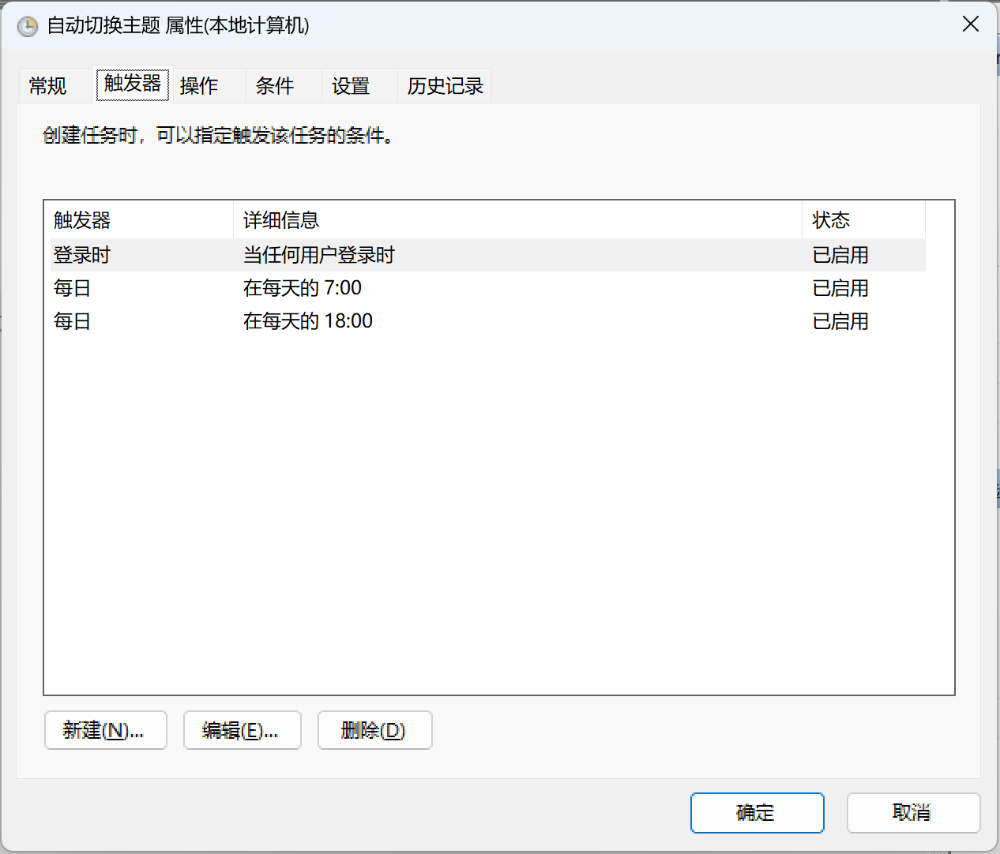
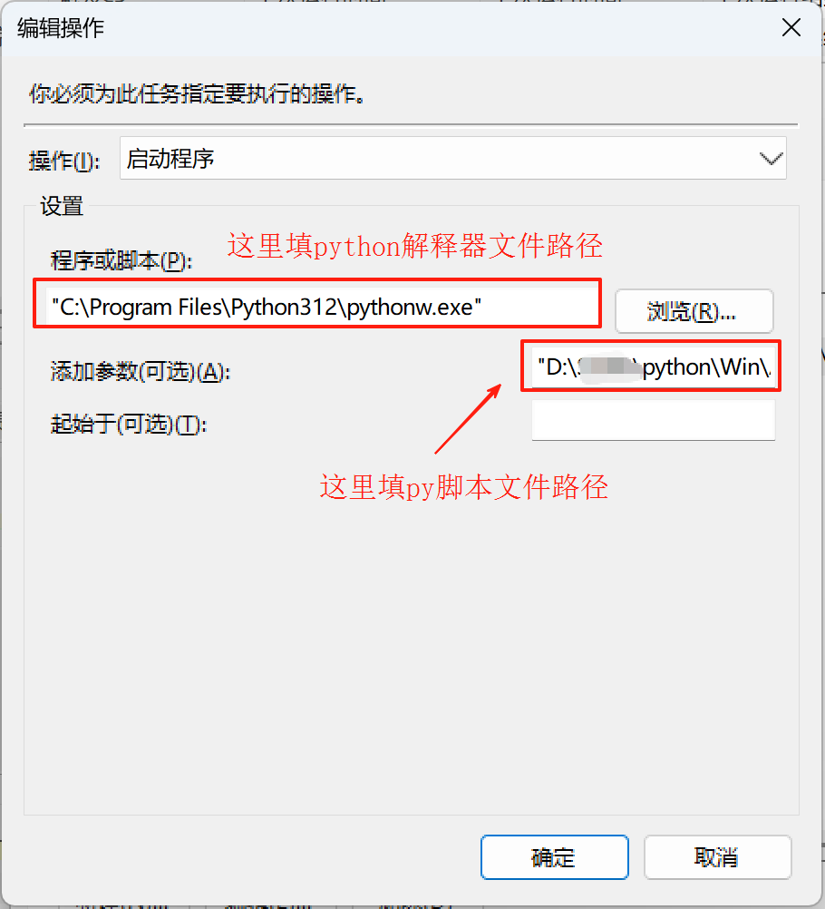
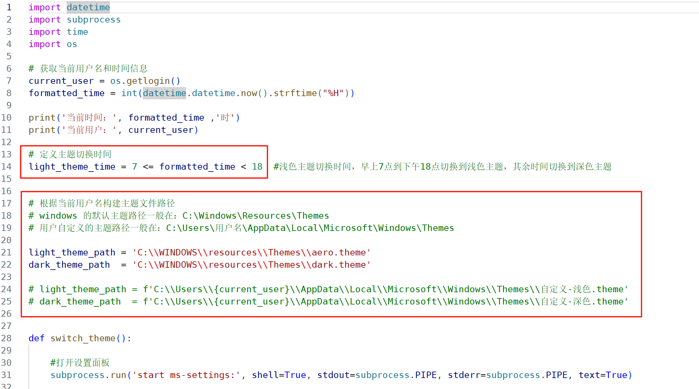

# win11_auto_theme

# 简介

这是一个根据自定义时间自动切换win11深浅色主题的py脚本，因为微软老大迟迟不肯推出跟随时间自定义切换深浅色主题的功能，网上虽然有其它软件可以实现，但是要在后台挂多一个软件对于我这种桌面洁癖患者来说是无法容忍的，于是乎我就自己花了一丢丢时间写了个脚本出来

# 使用方法

1. 先安装python库

    `pip3 install -r requirement.txt`

2. 需要配合windows系统的`任务计划程序`来食用脚本

这里添加几个执行条件，时间条件最好按照脚本里面的时间填
   
   

这里定义一下脚本执行路径，注意，python解释器要用`pythonw.exe`（后面多个w）这个exe可执行文件，这个不会弹出黑乎乎的命令窗口

   

3.根据脚本里面的注释，自己改一下时间和主题路径，也可以先不改，用我默认的

   